 Cpd Diary Testing

:arrow_left: [Return to the README](README.md)

## Table of Contents

# Performance

[Google Lighthouse](https://developer.chrome.com/docs/lighthouse/overview/) was used to test the performance of the website. 

Desktop

- Home page

  

- Entry List page

  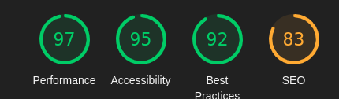
  
  - Entry Detail page

  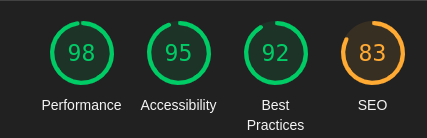
  
  - Entry Post page

  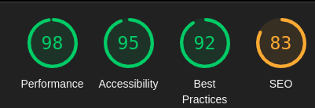
  
  - About page

  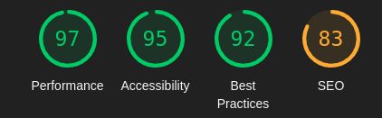

Mobile

- Home page

  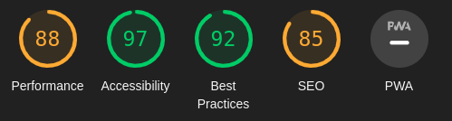

- Entry List page

  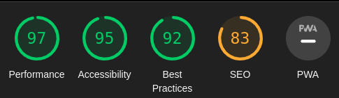
  
  - Entry Detail page

  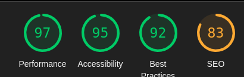
  
  - Entry Post page

  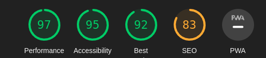
  
  - About page

  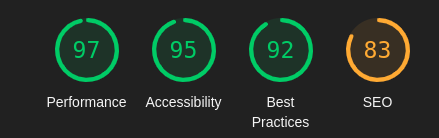

# Code Validation

## HTML Validation

The [W3C Markup Validation Service](https://validator.w3.org/) was used to validate the HTML of the website.

Home page

Entry List page

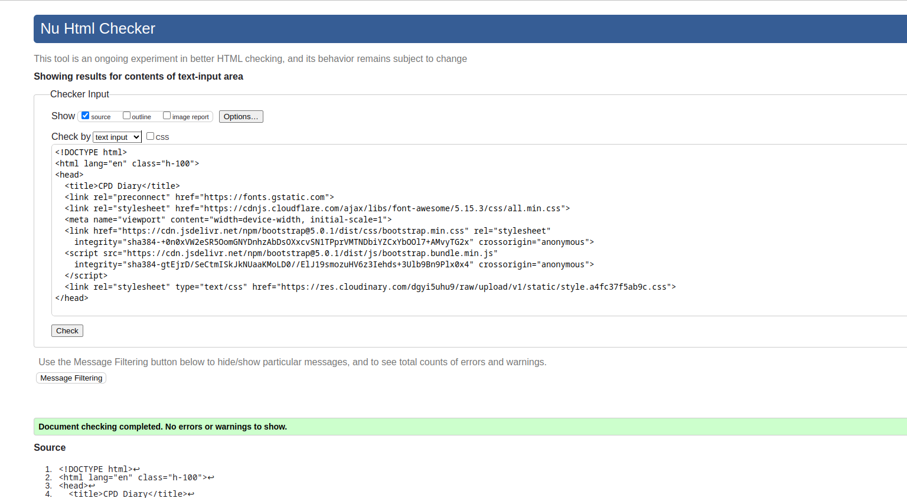

Entry Detail page

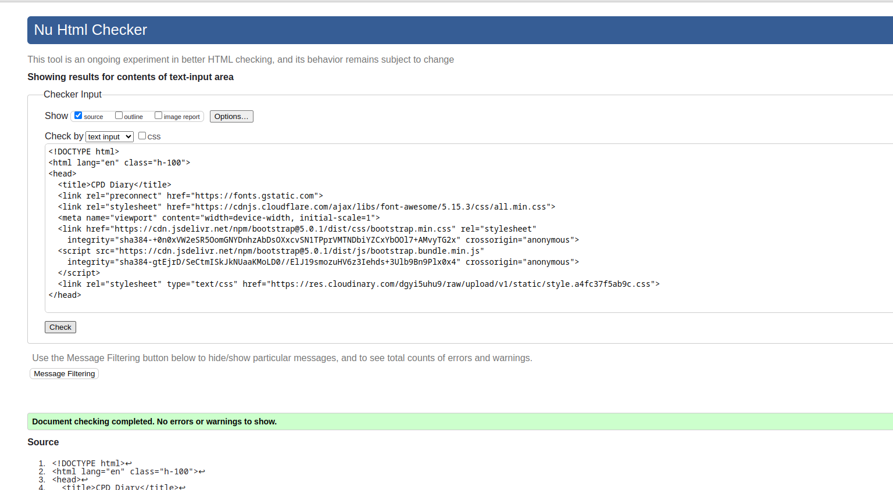

Login page

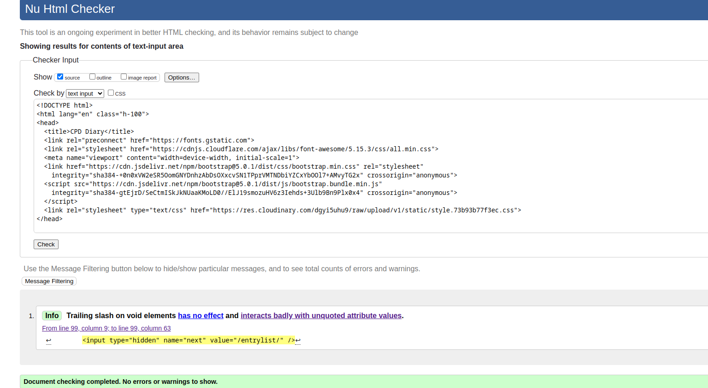

Sign Up page

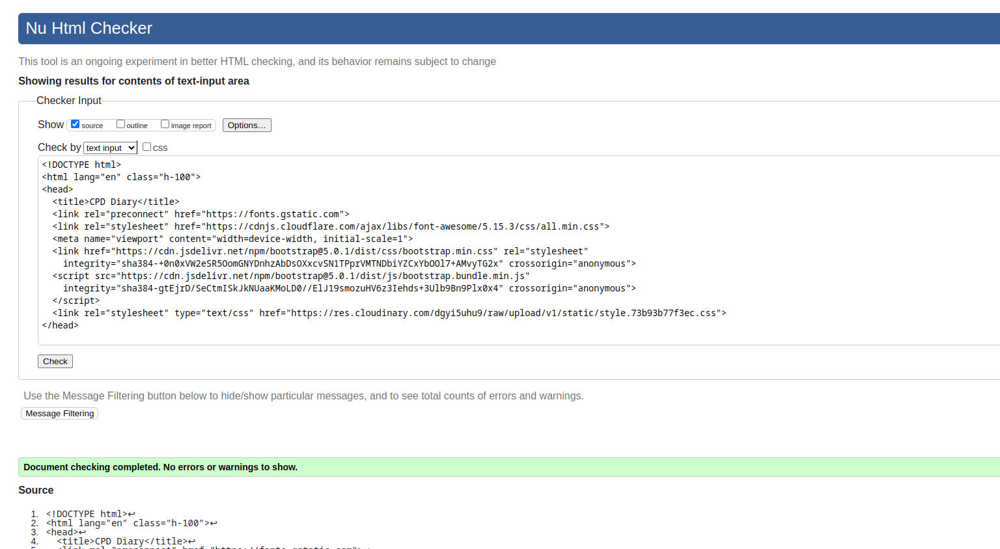

Logout page

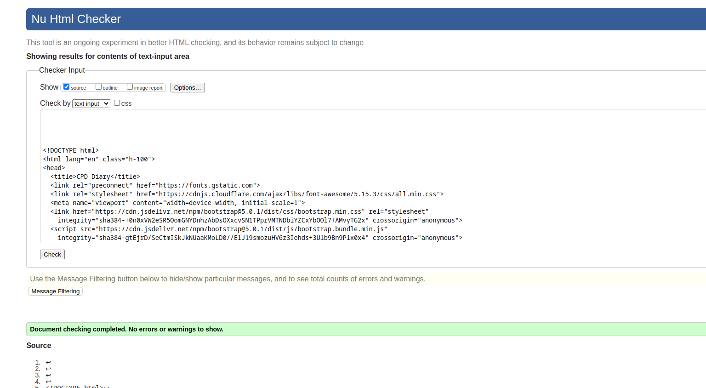

## CSS Validation

The [W3C Jigsaw CSS Validation Service](https://jigsaw.w3.org/css-validator/) was used to validate the CSS of the website.

The testing of the `style.css` file resulted in the following outcome:

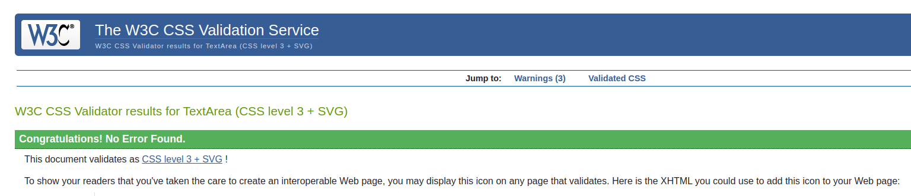

## JS Validation

[JSHint](https://jshint.com/) was used to validate the JavaScript of the website, which consists only of one function at the end of the base.html files.

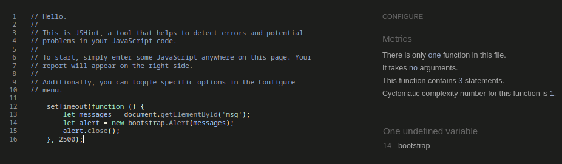

## Python Code Validation

The Python code was tested using the [CI Python Linter](https://pep8ci.herokuapp.com/).

**Python testing results for CPD Diary App:**

models.py

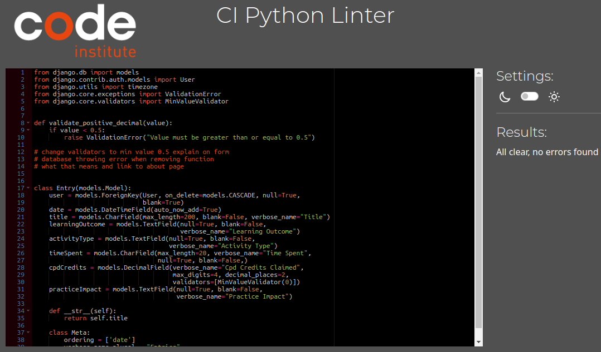

views.py

forms.py

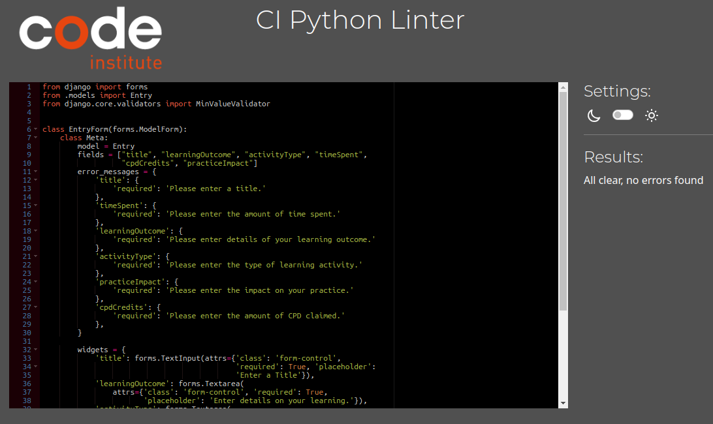

urls.py

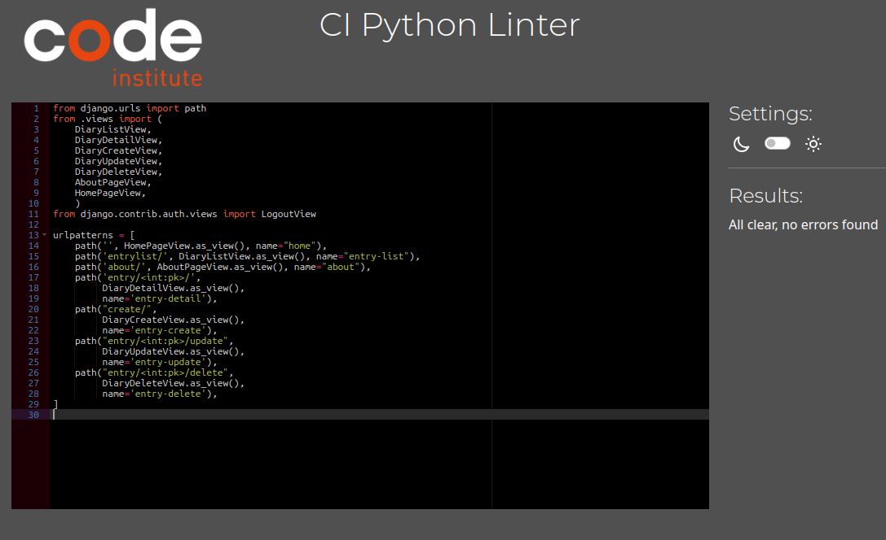

apps.py

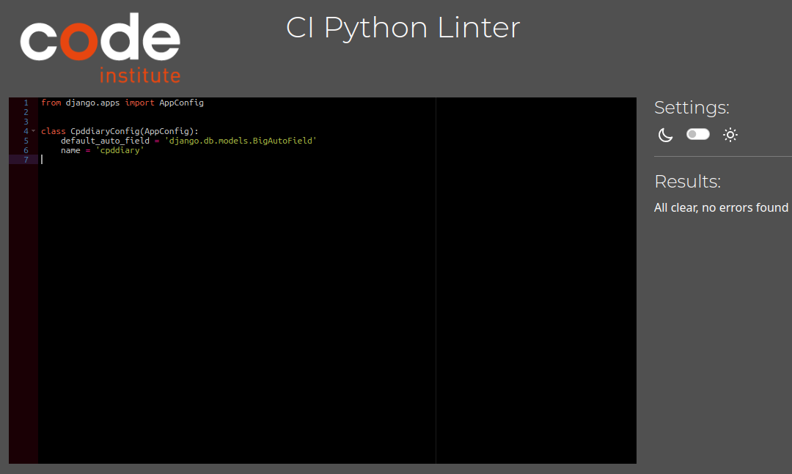

admin.py

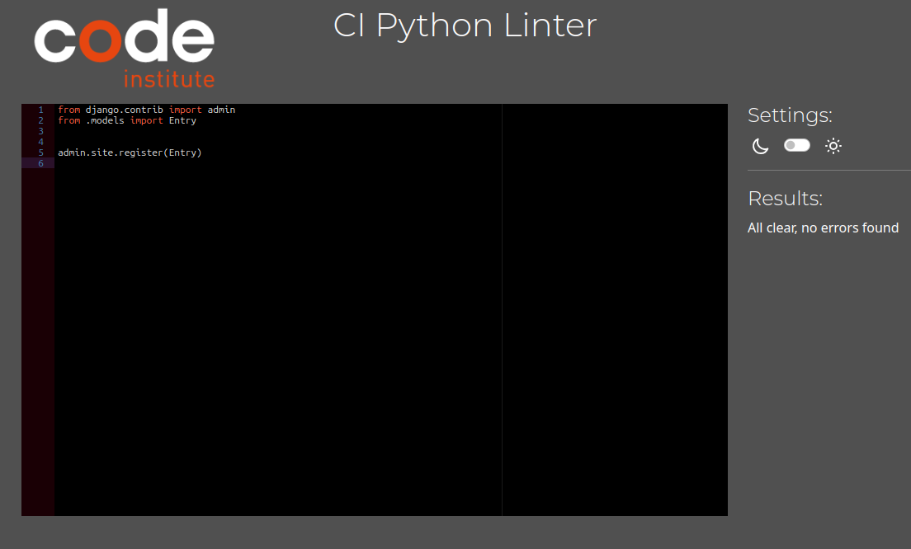

**Python testing results of P4_django_diary Files:**

asgi.py

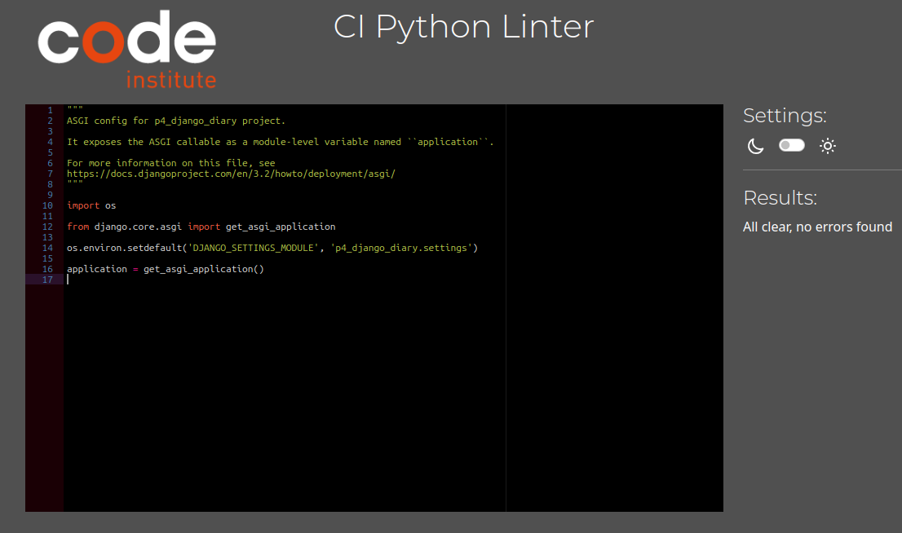

wsgi.py

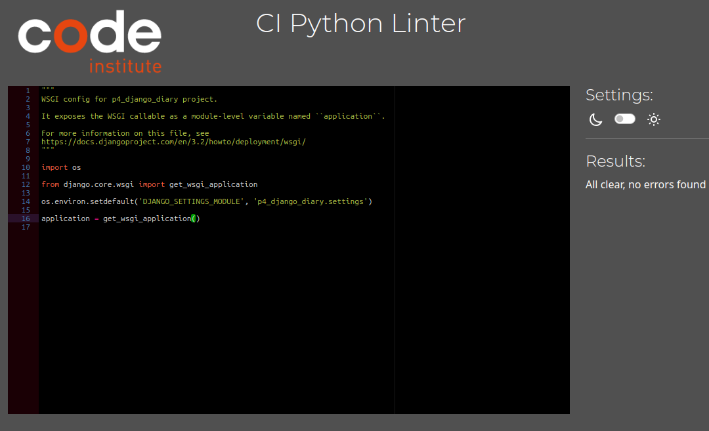

urls.py

## Manual Testing
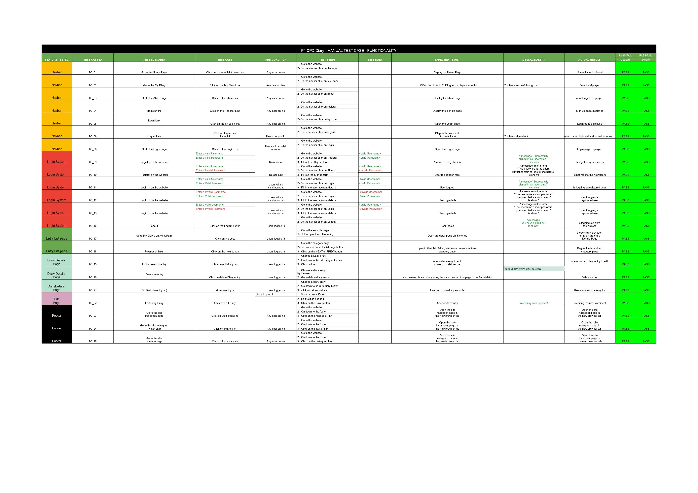
# Browser Testing

The application was tested on the following browsers and worked without issues:

- Chrome
- Firefox

bootstrap for mbile!
TIMEBOX doesnt indicate measurement of time!! minutes or hours?
CPD points box, adjust to whole numbers and halfs
FOOTER covers cancel box ant bottom of page

FIX NEGATIVE NUMBERS IN TIME SPENT AND CPD POints!!

first bug
python manage.py collectstatic --noinput
       Traceback (most recent call last):
         File "/tmp/build_fdefe8ef/manage.py", line 22, in <module>
           main()
         File "/tmp/build_fdefe8ef/manage.py", line 18, in main
           execute_from_command_line(sys.argv)
         File "/app/.heroku/python/lib/python3.11/site-packages/django/core/management/__init__.py", line 419, in execute_from_command_line
           utility.execute()
         File "/app/.heroku/python/lib/python3.11/site-packages/django/core/management/__init__.py", line 413, in execute
           self.fetch_command(subcommand).run_from_argv(self.argv)
         File "/app/.heroku/python/lib/python3.11/site-packages/django/core/management/base.py", line 354, in run_from_argv
           self.execute(*args, **cmd_options)
         File "/app/.heroku/python/lib/python3.11/site-packages/django/core/management/base.py", line 398, in execute
           output = self.handle(*args, **options)
                    ^^^^^^^^^^^^^^^^^^^^^^^^^^^^^
         File "/app/.heroku/python/lib/python3.11/site-packages/django/contrib/staticfiles/management/commands/collectstatic.py", line 187, in handle
           collected = self.collect()
                       ^^^^^^^^^^^^^^
         File "/app/.heroku/python/lib/python3.11/site-packages/django/contrib/staticfiles/management/commands/collectstatic.py", line 105, in collect
           for path, storage in finder.list(self.ignore_patterns):
         File "/app/.heroku/python/lib/python3.11/site-packages/django/contrib/staticfiles/finders.py", line 130, in list
           for path in utils.get_files(storage, ignore_patterns):
         File "/app/.heroku/python/lib/python3.11/site-packages/django/contrib/staticfiles/utils.py", line 23, in get_files
           directories, files = storage.listdir(location)
                                ^^^^^^^^^^^^^^^^^^^^^^^^^
         File "/app/.heroku/python/lib/python3.11/site-packages/django/core/files/storage.py", line 330, in listdir
           for entry in os.scandir(path):
                        ^^^^^^^^^^^^^^^^
       FileNotFoundError: [Errno 2] No such file or directory: '/tmp/build_fdefe8ef/static'
 !     Error while running '$ python manage.py collectstatic --noinput'.
       See traceback above for details.
       You may need to update application code to resolve this error.
       Or, you can disable collectstatic for this application:
          $ heroku config:set DISABLE_COLLECTSTATIC=1
       https://devcenter.heroku.com/articles/django-assets
 !     Push rejected, failed to compile Python app.
 !     Push failed

deploying to heroku
corrected some mispellings, added DISABLE_COLLECTSTATIC to config vars on heroku (this may cause issues with static files but that will be addressed when needed)

trying to restrict users viewing other users entries
    #def get_context_data(self, **kwargs):
        #data = super().get_context_data(**kwargs)

        #if self.request.user.is_authenticated:
            #data['user_posts'] = Entry.object.filter(user_id=self.request.user.id)

        #return data

    #def get_queryset(self):
        #return Entry.objects.filter(user_id=self.request.user.id)

       def get_queryset(self):
        return Entry.objects.filter(user=self.request.user)

    #def get_context_data(self, **kwargs):
        #context = super().get_context_data(**kwargs)
        #context['entry_list'] = context['entry_list'].filter(user=self.request.user)
        #context["entry"] = Entry.objects.all()
        #return context

login = 'login' caused rooting issues
previously created custom login and logout pages, decided to install allauth, 
had to remove, customview, urls and settings code

 not working 
created a root templates folder and moved allauth's account folder into it and it appears now our allauth login.html template is connected
When we use the allauth roots in our project, if allauth can't find the templates within our workspace, it substitutes in ones without any styling

installed allauth, downloaded templates
extending base 

forms.py, custom alerts written
alerts not happening?
removing 'cpdCredits': forms.DecimalField(
                label='CPD Credits',
                widget=forms.NumberInput(attrs={
                    'class': 'form-control',
                    'placeholder': 'Enter CPD Credits'}),
                validators=[MinValueValidator(0)]),

        widgets = {
            'title': forms.TextInput(attrs={'class': 'form-control',
                                            'required': True, 'placeholder':
                                            'Enter a Title'}),
            'learningOutcome': forms.Textarea(
                attrs={'class': 'form-control', 'required': True,
                       'placeholder': 'Enter details on your learning.'}),
            'activityType': forms.Textarea(
                attrs={'class': 'form-control', 'required': True,
                       'placeholder': 'Enter the type of activity.'}),
            'practiceImpact': forms.Textarea(
                attrs={'class': 'form-control', 'required': True,
                       'placeholder':
                       'Enter details on the impact on your practice.'}),
            'timeSpent': forms.TextInput(
                attrs={'class': 'form-control', 'required': True,
                       'placeholder': 'e.g. 3 hours',  'rows': 1, 'cols': 2}),
            'cpdCredits': forms.NumberInput(
                attrs={'class': 'form-control', 'required': True,
                       'placeholder': 'Enter CPD Credits Claimed'}
            ),
        }

    def __init__(self, *args, **kwargs):
        super(EntryForm, self).__init__(*args, **kwargs)
        self.helper = FormHelper()
        self.helper.form_class = 'form-control'
        self.helper.layout = Layout(
            Field('title', placeholder='Enter a Title', rows=1, cols=2),
            Field('learningOutcome',
                  placeholder='Enter details on your learning.'),
            Field('activityType', placeholder='Enter the type of activity.'),
            Field('practiceImpact',
                  placeholder='Enter details on the impact on your practice.'),
            Field('timeSpent', placeholder='e.g. 3 hours'),
            Field('cpdCredits', placeholder='Enter CPD Credits Claimed')
        )
        self.helper.form_method = 'post'

            <!--https://getbootstrap.com/docs/4.0/components/forms/-->
    

    

        <label for="{{ form.title.id_for_label }}">Title:</label>
        {{ form.title }}
        {{ form.title.errors }}
    

    

        <label for="{{ form.learningOutcome.id_for_label }}">Learning Outcome:</label>
        {{ form.learningOutcome }}
        {{ form.learningOutcome.errors }}
    

    

        <label for="{{ form.activityType.id_for_label }}">Activity Type:</label>
        {{ form.activityType }}
        {{ form.activityType.errors }}
    

    

        <label for="{{ form.timeSpent.id_for_label }}">Time Spent:</label>
        {{ form.timeSpent }}
        {{ form.timeSpent.errors }}
    

    

        <label for="{{ form.cpdCredits.id_for_label }}">CPD Credits:</label>
        {{ form.cpdCredits }}
        {{ form.cpdCredits.errors }}
    

    

        <label for="{{ form.practiceImpact.id_for_label }}">Practice Impact:</label>
        {{ form.practiceImpact }}
        {{ form.practiceImpact.errors }}
    

    <input type="submit" value="Save">

removed validate positive decimal
migrations failed due to missing validate positive decimal function
removed validators=[cpddiary.models.validate_positive_decimal] from timeSpent and cpdCredits migration file 7
reinstated code, as could not migrate, to return to this bug!! 

styling impacting view on mobile, timespent field, too small
footer is covering save/cancel options for user

alert messages not displaying (mispelling)

BUG TITLE FIELD NOT DISPLAYING ALERT?

installed crispy forms 
had errors, looking for uni forms?
TemplateDoesNotExist at /create/
bootstrap4/uni_form.html

Testing with 
input Date vs auto date

Used it on my phone.
Worked really well...well done you!

Feedback
I put in my name as username then set up my passwords.
When I tried to move on, my user name was rejected as I had a space in it and my passwords were deleted. I would have liked to have known in advance that I could not have spaces in my user name.
When entering a new event, the box beside time has e.g. in it. You cannot see anymore detail.
Small details from a grouchy customer...basically, very impressive!
