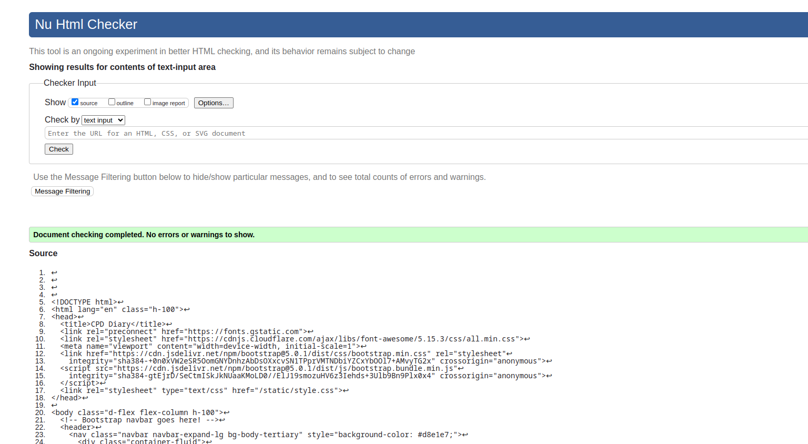

 Cpd Diary Testing

:arrow_left: [Return to the README](README.md)

## Table of Contents

# Performance

[Google Lighthouse](https://developer.chrome.com/docs/lighthouse/overview/) was used to test the performance of the website. 

Desktop

- Home page

  

- Entry List page

  
  
  - Entry Detail page

  
  
  - Entry Post page

  
  
  - About page

  

Mobile

- Home page

  

- Entry List page

  
  
  - Entry Detail page

  
  
  - Entry Post page

  
  
  - About page

  

# Code Validation

## HTML Validation

The [W3C Markup Validation Service](https://validator.w3.org/) was used to validate the HTML of the website.

Home page

Entry List page

Entry Detail page

Login page

Sign Up page

Edit page

Logout page

## CSS Validation

The [W3C Jigsaw CSS Validation Service](https://jigsaw.w3.org/css-validator/) was used to validate the CSS of the website.

The testing of the `style.css` file resulted in the following outcome:

## JS Validation

[JSHint](https://jshint.com/) was used to validate the JavaScript of the website, which consists only of one function at the end of the base.html files.

## Python Code Validation

The Python code was tested using the [CI Python Linter](https://pep8ci.herokuapp.com/).

**Python testing results for CPD Diary App:**

models.py

views.py

forms.py

urls.py

apps.py

admin.py

**Python testing results of P4_django_diary Files:**

asgi.py

wsgi.py

urls.py

## Manual Testing

<a href="https://docs.google.com/spreadsheets/d/e/2PACX-1vRJ_ssi9Q_JnTMd-aSr_MVfcuNgLtks3PaqIDYW8TbDvNrHQq61n4z9x-CyVurlz21kE_fZDsgvU-qA/pubhtml">Google sheet link</a>

# Browser Testing

The application was tested on the following browsers and worked without issues:

- Chrome
- Firefox

## Bugs / Issues

### 1. Negative numbers in CPD Credits field
I have created a function to handle negative values in the cpd credits field. I had also set the validators=[MinValueValidator(0)]. In trying to remove the function and use the validators=[MinValueValidator(0)] / migrating the model, Errors were generated, I would have to delete previous migrations. I will return to this after submission

"removed validate positive decimal
migrations failed due to missing validate positive decimal function
removed validators=[cpddiary.models.validate_positive_decimal] from timeSpent and cpdCredits migration file 7
reinstated code, as could not migrate, to return to this bug!! "

### 2. AllAuth install
Initially in I had created custom user login and logout pages, to better handle users logging in and out, later in the project I opted to install AllAuth.
This created some issues, one of which was splitting the template folders, one in the app and one in the root directory. That is the reason entry-confirm-delete, entry-detail and entry-form are saved in the cpddairy folder alongside the rest of the allauth templates.

login = 'login' caused rooting issues
previously created custom login and logout pages, decided to install allauth, 
had to remove, customview, urls and settings code

 not working 
created a root templates folder and moved allauth's account folder into it and it appears now our allauth login.html template is connected
When we use the allauth roots in our project, if allauth can't find the templates within our workspace, it substitutes in ones without any styling

### 3. Crispy forms install
Later in the project I had tried to install crispy forms, in doing so, crispy forms was looking for folers such as bootstrap4/uni-form.
I failed to get this correctly working, and reverted to styling with bootstrap form group.

"installed crispy forms 
had errors, looking for uni forms?
TemplateDoesNotExist at /create/
bootstrap4/uni_form.html"

### 4. Diary entry Date / Time
On posting a diary entry time, I could not find a way to correctly localise the time displayed. I have removed this.
In future updates, I plan to let the user input the date of their learning.

### 5. Search Bar
The search bar is working on entry list page, but on removing text from the search bar input the page does not refresh.

### 6. Confirm Delete buttons not aligning
Just before submit, i changed the styling, they are not aligning and I do not have the time to fix. To return to fix. 

:arrow_left: [Return to the README](README.md)
